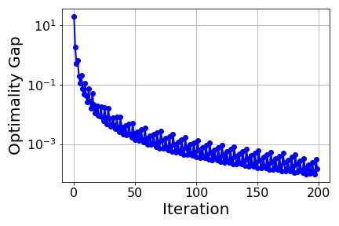

# Frank-Wolfe-Algorithm
Implementation of the Frank-Wolfe algorithm (aka conditional gradient method) for minimizing any convex function with linear constraints.

### Description
File `FrankWolfe.py` includes the `frank_wolfe()` class for minimizing a convex function by iteratively using a linear program solver. This is possible by approximating the target function with its gradient and solving a linear program where the gradient of the function at the xurrent point serves as weight for the objective. This is particularly useful when solving the convex problem takes a lot of time but the iterative process can produce a feasible solution that is on the edges of the polytope formed by the linear constraints.

The main file `fw_main.py` demonstrates an exxample of running the Frank-Wolfe algorithm for the function specified in `min_fun()`. Parameters like the variable bounds and constraint weight matrix and upper bounds are defined in a way similar to that of `scipy.optimize.linprog()`, which is used for solving the linear programs.

An optimality gap comparison with scipy's convex solver is produced graphically (as shown below) which in theory is (O(1/ε) where ε is the number of Frank-Wolfe iterations. 

